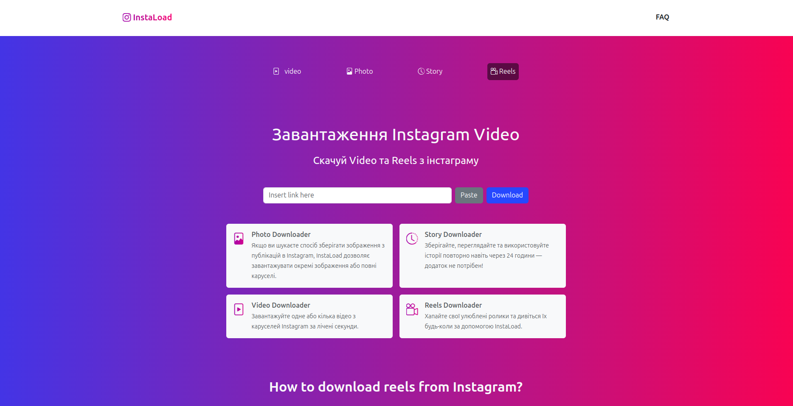

# InstaLoad

> **InstaLoad** — A mini-service for quickly downloading videos, photos, Reels and Stories from Instagram in two clicks. Built on Django 5 and Bootstrap 5. Easily deployed on Render.com without a separate web server — static files are served by Whitenoise.

---

## Main features

| Feature | Description |
|---------|-------|
| **Video Downloader** | Download one or more videos from carousels. |
| **Photo Downloader** | Save individual photos or entire carousels. |
| **Reels Downloader** | Get any Reels via the link. |
| **Story Downloader** | Saving Story even after 24 hours. |
| **FAQ-секція**       | Hover over "FAQ" in the navigation for quick answers.|

---

## Interface



---

## ⚙️ Setup:

1. **Clone & open the repository:**
   ```bash
   git clone https://github.com/your-username/note-plus-plus.git
   cd note-plus-plus
   ```

2. **Create a virtual environment:**
   ```bash
   python -m venv venv
   source venv/bin/activate  # Linux / Mac
   venv\Scripts\activate     # Windows
   ```

3. **Install dependencies:**
   ```bash
   pip install django
   ```

4. **Apply database migrations:**
   ```bash
   python manage.py migrate
   ```

5. **Create superuser (optional):**
   ```bash
   python manage.py createsuperuser
   ```

6. **Run server:**
   ```bash
   python manage.py runserver
   ```

7. **Перейти в браузері:**
   ```
   http://127.0.0.1:8000/
   ```
##  Demo

https://instaload-sl70.onrender.com


##  Technology stack:
- **Python 3.11**, **Django 5.2**
- **Gunicorn** — WSGI-server
- **Whitenoise** — statics support
- **Bootstrap 5** & **Bootstrap Icons**
- **Requests** — accessing Instagram RapidAPI endpoints
---

